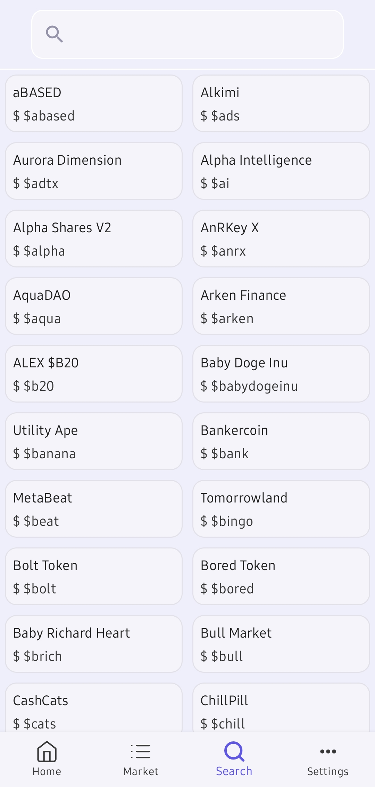

### Geckoin Compose
My Gecoin app re-writed in Compose. 
Geckoin Compose is a cryptocurrency simple app for basic market info, top coins list and search in all available tokens by consuming "CoinGecko" API.
In this sample project I tried to develop a standard and modern android app with best practices and some the most useful jetpack compose.  

  
  
  
  
  

### Features
* Kotlin
* Jetpack Compose: all screens and components developed with Compose. 
* Clean Architecture 
* MVVI design pattern with reducer for state managment
* Offline-First with repository pattern(all screens except coin details page)
* Kotlin Coroutines & Flows for concurrency, observer pattern and data streaming.
* Room & DataStore For data persistence and caching. 
* Dagger Hilt for dependency injection. 
* WorkManager for background task and synchronizing coins database.
* Paging 3.0: for pagination with offline support. 
* Light/Dark Mode and Material3.0 design
* Ktor and OkHttp with coroutines for networking
* Vico for Line charts
* Coil for image loading
* Kotlin Arrows: test kotlin arrow on this project 
* CoinGecko Free Api: All data provided by coingecko public api (https://www.coingecko.com/en)
